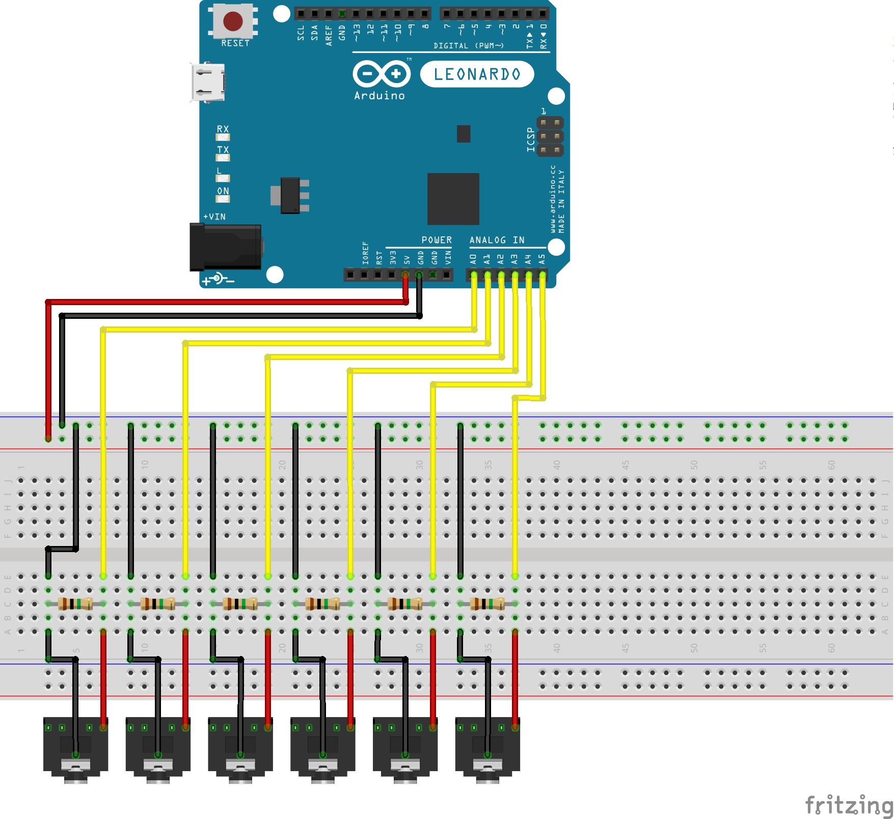

This project is a low cost MIDI controller for amateurs drummers like me.

You can use as a MIDI controller for programs like Addictive Drums, Fruity Loops, Hydrogen or whatever MIDI capable software.

## Bill of materials

|Quantity|Component|
|--|--|
|1|Arduino (UNO, Leonardo, etc)|
|6|1MΩ Resistor|
|6|Audio Jack (TS) 3.5mm|

You may also need:

|Quantity|Component|
|--|--|
|1|Breadbord|
|1|USB to Micro USB Cable (PC to Arduino)|
|-|Wire|

## Breadboard

In the breadboard a TRS audio jack was used but only a mono jack is needed.
So, you can replace it with a TS audio jack as listed in the Bill os materials.

## General MIDI from drums

In general, drummachines implements these midi signals.

|Midi|Description       |Midi|Description       |Midi|Description       |
|----|------------------|----|------------------|----|------------------|
|35| Acoustic Bass Drum |36| Bass Drum 1        |37| Side Stick         |
|38| Acoustic Snare     |39| Hand Clap          |40| Electric Snare     |
|41| Low Floor Tom      |42| Closed Hi-Hat      |43| High Floor Tom     |
|44| Pedal Hi-Hat       |45| Low Tom            |46| Open Hi-Hat        |
|47| Low-Mid Tom        |48| Hi-Mid Tom         |49| Crash Cymbal 1     |
|50| High Tom           |51| Ride Cymbal 1      |52| Chinese Cymbal     |
|53| Ride Bell          |54| Tambourine         |55| Splash Cymbal      |
|56| Cowbell            |57| Crash Cymbal 2     |58| Vibraslap          |
|59| Ride Cymbal 2      |60| Hi Bongo           |61| Low Bongo          |
|62| Mute Hi Conga      |63| Open Hi Conga      |64| Low Conga          |
|65| High Timbale       |66| Low Timbale        |67| High Agogo         |
|68| Low Agogo          |69| Cabasa             |70| Maracas            |
|71| Short Whistle      |72| Long Whistle       |73| Short Guiro        |
|74| Long Guiro         |75| Claves             |76| Hi Wood Block      |
|77| Low Wood Block     |78| Mute Cuica         |79| Open Cuica         |
|80| Mute Triangle      |81| Open Triangle      |

## Todos

- [x] Schematic;
- [x] Bill of materials;
- [ ] Used algorithms;
- [ ] Dependencies;
- [ ] gh-page;
- [ ] Assembly instructions for Pads and bass drum pedal.
